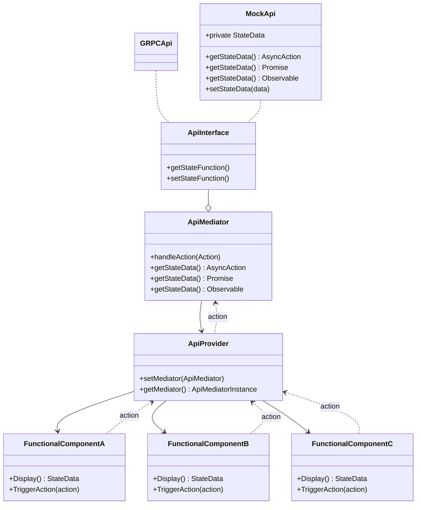

# MediatorPatternDoc
Created Documentation for the Mediator Pattern as a type of guidelines for my self using React, Typescript, and Javascript.

# About Mediator

Mediator is a UI/UX pattern for building components and interacting with Api Calls, by using the Mediator pattern the UI/UX can maintain a micro-service architecture for easier testing and reusability.

---
#### Graph Representation of Data Flow


In this example we have both the GRPC Api and a mock Api which imitates the GRPCApi. This allows us to test our components and logic without having to repeatedly hit the backend methods by simply calling the MockApi instead.

---
#### ApiMediator Example

The ApiMediator is where we define our class definition and functions. Below is an example implementation.

```typescript
export class AnimalMediatorExample {
  private api: AnimalApi;
  animal = new AsyncActionRunner({name: "cat", legs: 4});
  changedAnimalsCount = new ObservableValue(0);

  constructor(api: AnimalApi){
    this.api = api;
  }
  getBigCat() {
    const action = new AsyncAction(()=>{
      const [request, cancel] = this.api.getBigCat(); // returns Promise.resolve({name:"lion", legs: 4});
      action.onCancel(cancel); // optional method
      return request;
    });

    changedAnimalsCount.setValue(changedAnimalsCount().getValue()++);

    return this.animal.execute(action);
  }
  getSmallCat() {
    const action = new AsyncAction(()=>{
      return this.api.getSmallCat(); // returns Promise.resolve({name:"bobcat", legs: 4});
    });

    changedAnimalsCount.setValue(changedAnimalsCount().getValue()++); 
    
    return this.animal.execute(action);
  }
}
...
```

`AsyncAction`s: extend the functionality of `Promise`, they are able to retry and cancel the execution.

`AsyncActionRunner`: extends `ObservableValue` to handle only Asynchronous Values.
To do this it executes `AsyncAction`s and notifies any party of the status of that action. `AsyncActionRunner` stores the following properties:
- status: "initial" | "pending" |  "success" | "error" | "disabled"
- value: `{ name: string, legs: number } // From AnimalMediatorExample`
- error: any

These properties can be updated indefinitely, and can be subscribed to in the the components.
For more information on `Observables` and `Subjects` see [RxJs](https://rxjs-dev.firebaseapp.com/guide/observable)

_note: AsyncActionRunner does trigger component re-renders every time it updates._

---
#### ApiProvider Example
```typescript
import React, { useMemo, useEffect } from 'react';
import { AnimalMediatorExample } from './AnimalMediatorExample';
import { MockApi } from './MockApi';
import { IApi } from './IApi';

export const AnimalContext = React.createContext(new AnimalMediatorExample(new MockApi()));

export interface Props {
  children?: React.ReactNode | React.ReactNode[];
  api?: IApi;
}

const AnimalProvider = ({ api, children }: Props) => {
  const mediator = useMemo(() => {
    if (api != null) {
      return new AnimalMediatorExample(api);
    } else {
      return new AnimalMediatorExample(new MockApi());
    }
  }, [api]);

  useEffect(() => () => mediator.dispose(), [mediator]);

  return (
    <AnimalContext.Provider value={mediator}>{children}</AnimalContext.Provider>
  );
};

export default AnimalProvider;
```

In the `AnimalProvider` we create a Context that can be passed to any children components, this is similar to instantiating the class `AnimalMediatorExample` and saving it to a local const so that we can access the properties and functions.

__React Example Usage for `AnimalProvider`__
```typescript
import React from 'react';
import AnimalProvider from './AnimalProvider';
import CatComponent from './CatComponent';

const AnimalProviderWrapper = () => {
  return (
    <AnimalProvider> //or can pass in as a prop an Api to override the MockApi <AnimalProvider api={AnimalApi}>
      <CatComponent />
    </AnimalProvider>
  );
};
```
This would ensure that `<CatComponent />` has access to the AnimalMediator context.

[More information on React Context can be found here](https://reactjs.org/docs/context.html)

__Functional Components Using Mediators Data from Context Provider Example__
```typescript
import React from 'react';
import { useAsyncValue } from '@operator/shared/utils/mediator/hooks/useAsyncValue';
import { AnimalContext } from './AnimalProvider.tsx';

const CatComponent = () => {
  const mediatorContext = React.useContext(AnimalContext);
  const bobCat = useAsyncValue(mediatorContext.getSmallCat()); //useAsyncValue returns the value insde of the promise { name: 'bobcat', legs: 4 }
  return (
    <div>
      <p>I Have a pet {bobCat.name}</p>
    </div>
  );
}; 
```
_note: useAsyncValue is a custom hook built to retrieve the value inside of a Promise_

___
#### Notes on writing Tests for components

Jest will occasionally throw a strange error with our new mediator pattern, the error details are usually not very clear but a few things that can help clear up where the problem is coming from is by wrapping the test component in a context and ensuring it is provided a mockapi.
```typescript
const mockApi = {
  getSmallCat: jest.fn().mockImplementation(() => [Promise.resolve(), () => {}]),
  getBigCat: jest.fn().mockImplementation(() => [Promise.resolve(), () => {}]),
};
test('Should Display Animal Component', () => {
  render = (
    <AnimalProvider api={mockApi}>
      <CatComponent />
    </AnimalProvider>
  );
...
```

---
# Mediator Principles
### Single Responsibility Principle 
Mediators should have one responsibility and do it well. // Under construction
